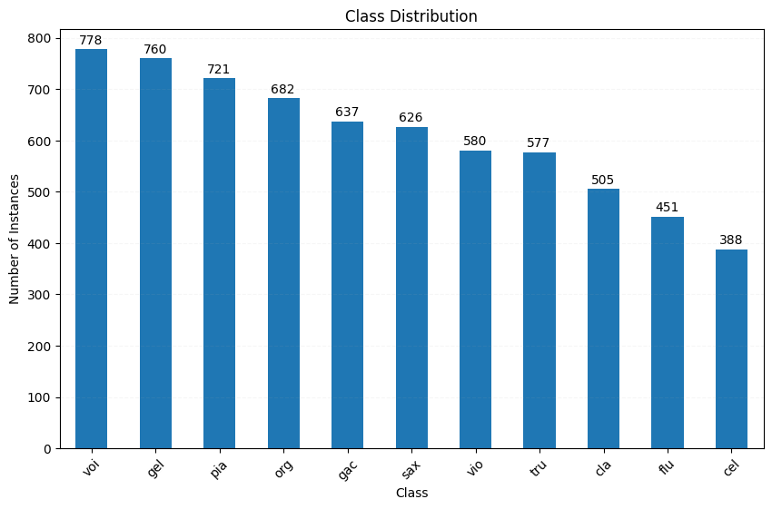
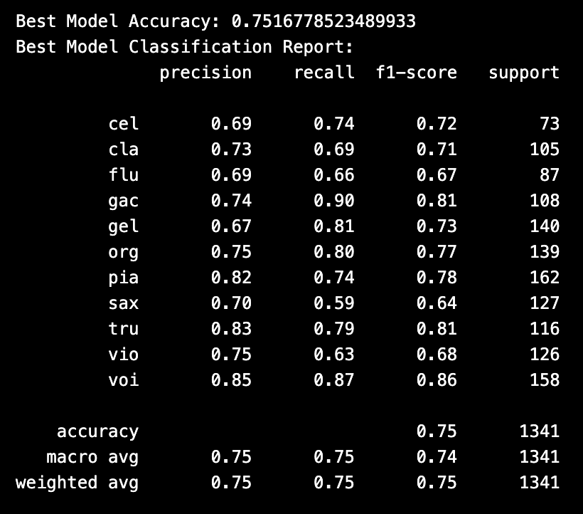

This project tackles the challenge of identifying musical instruments in a song using machine learning. The goal is to develop a model that can analyze audio recordings and classify the instruments present, like piano, guitar, or others.
To achieve this, the project leverages live music recordings and a three-pronged approach:

1. Data Collection and Preprocessing: The project utilizes the IRMAS (https://www.upf.edu/web/mtg/irmas) dataset for training containing thousands of labeled audio files across various instruments: cello (cel), clarinet (cla), flute (flu), acoustic guitar (gac), electric guitar (gel), organ (org), piano (pia), saxophone (sax), trumpet (tru), violin (vio), and human singing voice (voi). The number of files per instrument are: cel(388), cla(505), flu(451), gac(637), gel(760), org(682), pia(721), sax(626), tru(577), vio(580), voi(778).

2. Feature Extraction: Essentia, an open-source library, extracts over 370 unique characteristics from each audio sample, capturing its musical essence.
3. Model Training and Classification: An XGBoost model is trained on this rich dataset, learning to associate these features with specific instruments. The resulting model boasts an accuracy of 75% in identifying 11 different instruments within a music piece.

 

